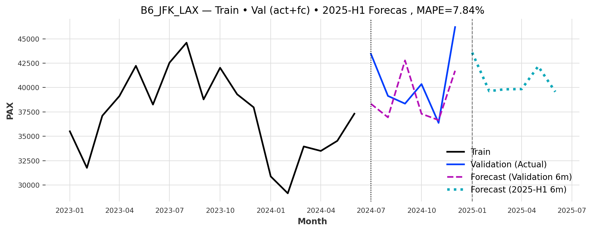
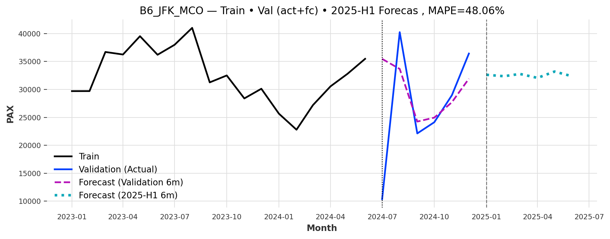
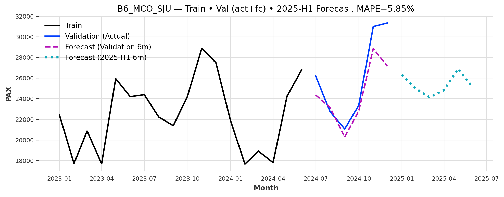
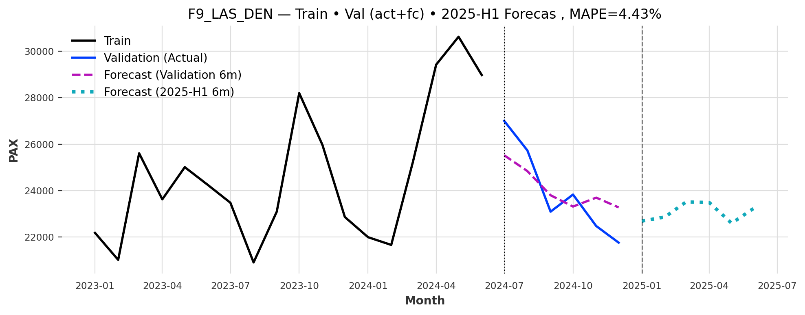

# Passenger-Forecast
Worked on Passenger Forecasting in the Aviation Industry (IATA, Lausanne) using real-world passenger data. Conducted EDA to detect trends, seasonality, and anomalies; built forecasting models (ARIMA, Prophet, ML-based) to predict demand; applied fraud detection; and reduced baseline MAPE error by 4%.

# ✈️ Passenger Forecasting in the Aviation Industry

This project explores **passenger forecasting** using real-world aviation data from IATA.  
It combines **exploratory data analysis (EDA)**, **fraud/anomaly detection**, and **forecasting models** to predict future passenger volumes per route.  

🔗 **Live Demo**: [Flightpath Predict](https://flightpath-predict.lovable.app/)  

---

## 📊 Project Overview
- **EDA**: Trend analysis, seasonal decomposition, popular and efficient routes.  
- **Fraud Detection**: Rule-based (seat factor > 1), Z-score anomaly detection, and multivariate ML methods.  
- **Forecasting**: Compared baseline models (Naive, AutoARIMA, Prophet) against ML-based models (LightGBM, NBEATS, TCN).  
- **Result**: Reduced baseline MAPE error by **4%** through model tuning and feature engineering.  

---

### Forecast Results

**JFK → LAX**

**JFK → MCO**

**MCO → SJU**

**LAS → DEN**

---

## ⚙️ Tech Stack
- **Languages**: Python  
- **Libraries**: pandas, numpy, matplotlib, seaborn, scikit-learn, statsmodels, Prophet, LightGBM, Darts  
- **Visualization**: Plotly, Matplotlib  
- **Deployment**: Lovable App Builder ([Flightpath Predict](https://flightpath-predict.lovable.app/))  

---

## 🚀 Features
✔️ EDA dashboard with trends & anomalies  
✔️ Fraud detection via hybrid anomaly methods  
✔️ Forecasting for **6-month horizons per route**  
✔️ Web app to **choose model + route**, visualize results, and download forecasts  

---

